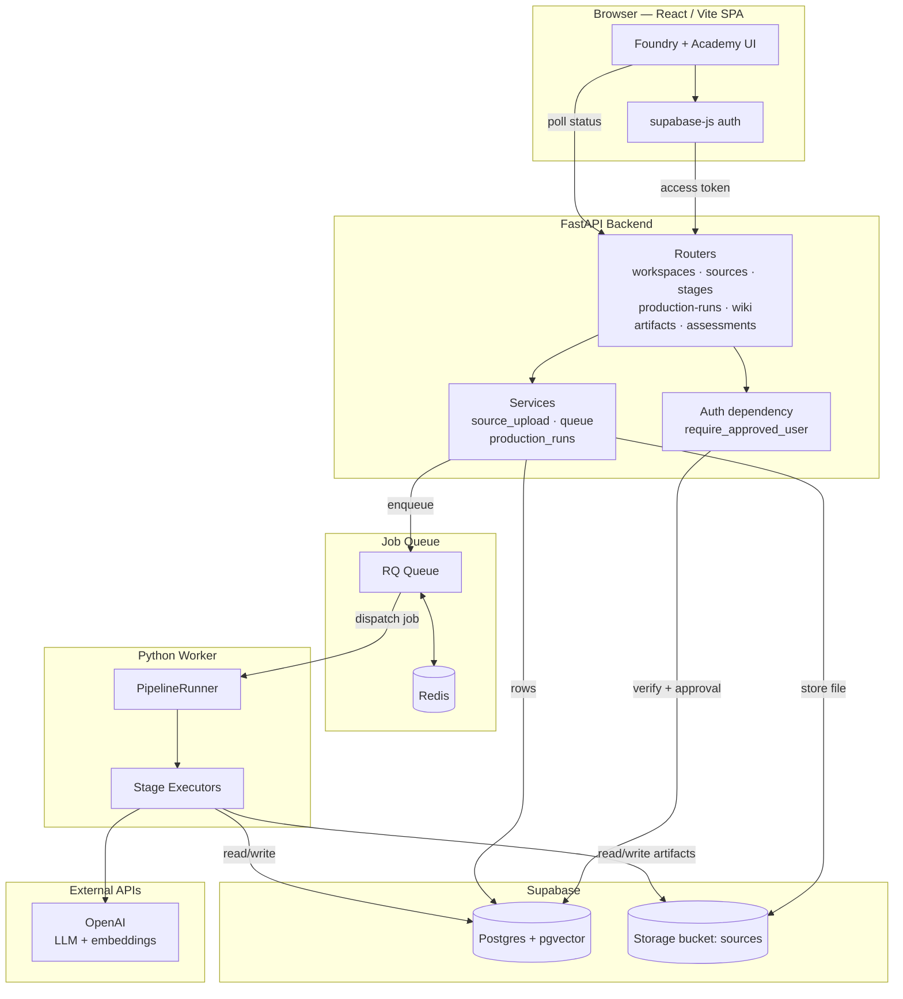
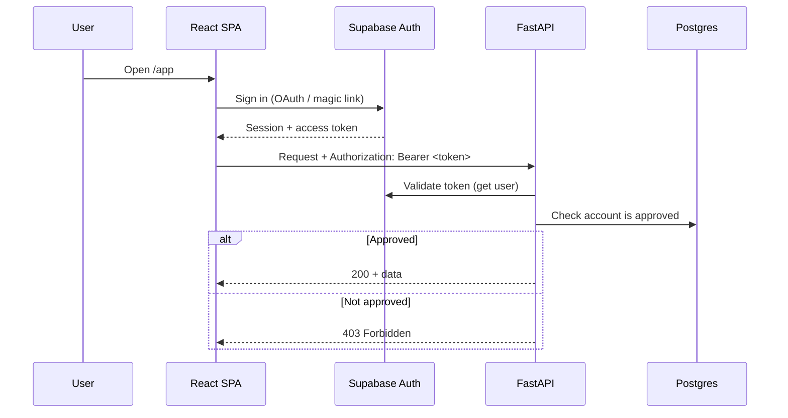
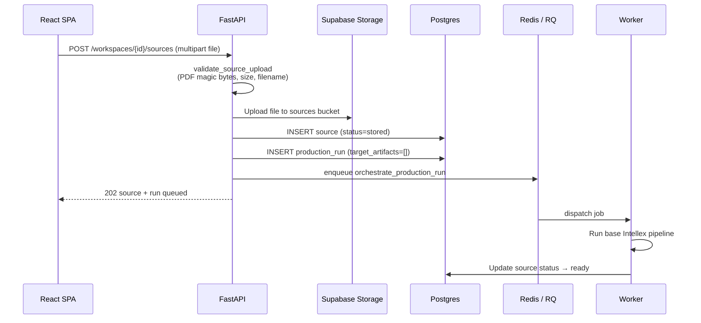
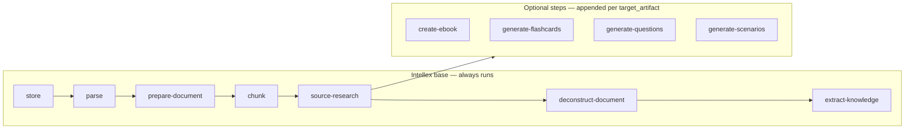
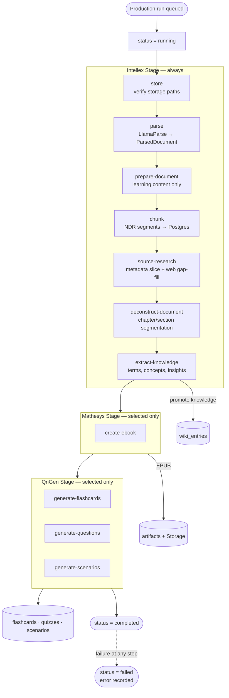
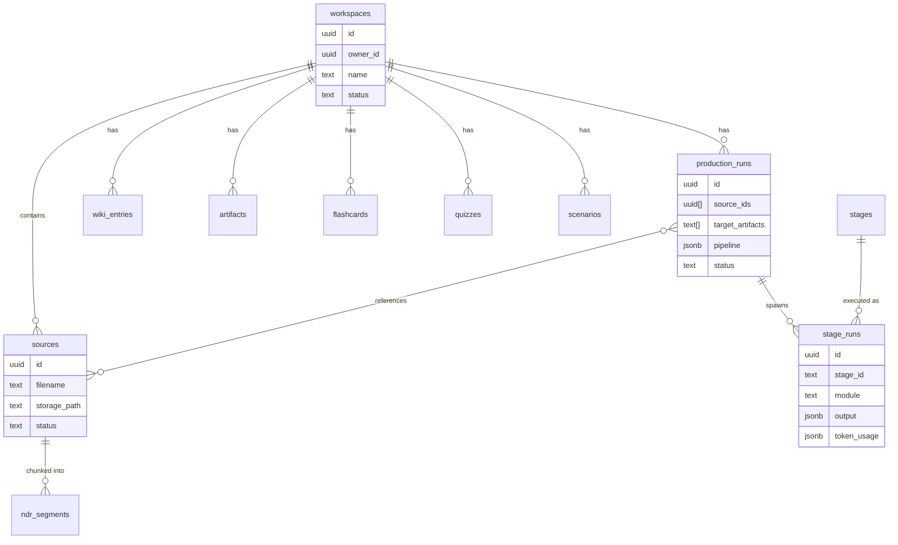

# Arsenal

Arsenal is a private educational system with two surfaces in one SPA:

- **Foundry** — browser-based **educational production studio**. It transforms raw source documents into structured knowledge, listenable narration artifacts, and assessment questions through three coordinated automation systems running over a queued worker pipeline.
- **Academy** — learning surface for viewing and interacting with artifacts produced by Foundry.

| Foundry system | Role | Module |
|--------|------|--------|
| **Intellex** | The library — ingests, parses, researches, and deconstructs sources into a grounded knowledge base. | `intellex` |
| **Mathesys** | The teacher — turns the knowledge base into narration scripts and audio-ready artifacts. | `mathesys` |
| **QnGen** | The examiner — produces flashcards, quizzes, and scenarios from the material. | `qngen` |

---

## High-Level Architecture



The browser authenticates with Supabase directly (`supabase-js`) and sends the resulting access token to FastAPI on every request. FastAPI verifies the token and an approval check before serving data. Long-running AI work never blocks the request: the API enqueues a job on Redis/RQ, and a separate Python worker executes the pipeline, writing results back to Postgres and Storage that the UI polls.

---

## Request & Authentication Flow



Every endpoint except `/health` requires `Authorization: Bearer <supabase-access-token>`. The `require_approved_user` dependency rejects invalid sessions (401) and unapproved accounts (403). The backend uses the Supabase **service role** key for data access; the service role key is never exposed to the frontend.

---

## Source Upload & Ingest

Uploading a source automatically queues an **ingest-only** production run (the Intellex base pipeline). PDFs are the only supported source type today.



---

## The Production Pipeline

A **production run** is the unit of work that turns selected sources into artifacts and assessments. The user selects source files and a set of `target_artifacts`; the backend builds an ordered pipeline (`build_pipeline`) and enqueues it. The worker's `PipelineRunner` executes each step in order, updating the run's `pipeline` JSON after every step so the UI can show live progress.

### Pipeline composition

The pipeline always runs the **Intellex base steps**, then appends only the **optional stage steps** matching the requested `target_artifacts`. An empty `target_artifacts` list runs ingest only. When a source was already fully ingested in a prior run, those Intellex steps are skipped and the run proceeds directly to the requested artifact stages.



| `target_artifact` | Pipeline step | Module | Output |
|-------------------|---------------|--------|--------|
| `electronic_book` | `create-ebook` | Mathesys | Electronic Book (one chapter-based EPUB for manual upload) |
| `flashcards` | `generate-flashcards` | QnGen | Flashcard set |
| `quizzes` | `generate-questions` | QnGen | Question set |
| `scenarios` | `generate-scenarios` | QnGen | Scenario set |

### Full pipeline execution



Each stage step runs once per selected source, recording an immutable `stage_run` row (inputs, output, model, token usage). Intellex `prepare-document` strips non-learning content; `deconstruct-document` persists chapter/section groupings in `document_chapters`; `extract-knowledge` promotes terms, concepts, and insights into `wiki_entries`. Mathesys `create-ebook` builds one simple EPUB per source from `document_chapters` (chapter titles, subsection headings, body text) for manual ElevenReader upload; the resulting `electronic_book` artifact lands in Storage with a signed URL served on download. QnGen stages promote `flashcards`, `quizzes`, and `scenarios`. If any step raises, the run is marked `failed`, the error is recorded, and in-flight sources are reset.

---

## Data Model



Stages are **versioned definitions** (`stage_id` + `version`, major.minor format such as `1.0` or `2.0`) seeded in Postgres; each execution creates a `stage_run` capturing the exact inputs, output, model, and token usage. Postgres has `pgvector` enabled for embedding-based search over NDR segments and wiki entries.

---

## Tech Stack

| Layer | Technology |
|-------|------------|
| Frontend | React + Vite + TypeScript, React Router |
| Auth | Supabase Auth (`supabase-js`) |
| Backend API | FastAPI (Python) |
| Job queue | RQ + Redis |
| Workers | Python (`PipelineRunner` + stage executors) |
| Database | Supabase Postgres + pgvector |
| File storage | Supabase Storage (`sources` bucket; per-source `parse/`, `structure/`, `narration/`, `artifacts/`) |
| LLM / embeddings | OpenAI |
| PDF parsing | LlamaParse (LlamaCloud, agentic tier) |

---

## Repository Layout

```text
Arsenal/
├── api/                      FastAPI backend + worker
│   └── app/
│       ├── routers/          HTTP endpoints
│       ├── services/         upload, queue, supabase, openai
│       ├── repositories/     Postgres data access
│       ├── intellex/         ingest, parsing, chunking, deconstruction stages
│       ├── mathesys/         narration / EPUB / SSML stages
│       ├── qngen/            flashcard / quiz / scenario stages
│       ├── worker/           PipelineRunner, stage executors, RQ jobs
│       └── pipeline.py       pipeline composition (base + optional steps)
├── app/                      React + Vite frontend
│   └── src/
│       ├── features/         auth + workspace providers
│       ├── components/foundry/   Foundry production UI
│       ├── components/academy/   Academy learning UI
│       └── lib/              API client + mappers
├── supabase/
│   └── setup/                greenfield SQL (01–04) + alter patches for existing DBs
├── docker/                   docker-compose (Redis)
└── docs/internal/            system overview & design notes
```

---

## Getting Started

Setup, environment variables, and the full endpoint reference live in [`api/README.md`](api/README.md). In short:

1. **Backend** — create a venv, install `api/requirements.txt`, populate `api/.env`, run `uvicorn app.main:app --reload --port 8000`.
2. **Queue + Worker** — start Redis (`docker compose up -d redis`), then run `python run_worker.py`.
3. **Database** — for a new Supabase project, run `01`–`04` in order (see [`supabase/setup/README.md`](supabase/setup/README.md)). Existing databases use the `alter-*.sql` patches in that same folder — see [`supabase/README.md`](supabase/README.md).
4. **Frontend** — point `VITE_API_BASE_URL` at the API and run the Vite dev server (see [`app/README.md`](app/README.md)).

For architectural rationale and the design narrative, see [`docs/internal/system/system-overview.md`](docs/internal/system/system-overview.md).
